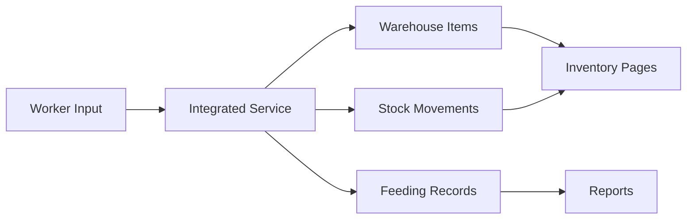

# نظام المخزون المتكامل - Integrated Inventory System

## نظرة عامة | Overview

تم إنشاء نظام متكامل يربط بين مدخلات العمال ونظام المخزون الأساسي، مما يضمن الاتساق الكامل للبيانات عبر جميع أجزاء النظام.

An integrated system has been created that connects worker inputs with the main inventory system, ensuring complete data consistency across all parts of the system.

## المكونات الجديدة | New Components

### 1. خدمة المخزون المتكاملة | Integrated Inventory Service
**الملف**: `client/lib/integrated-inventory-service.ts`

**الوظائف الرئيسية**:
- `addFeedToInventory()` - إضافة أعلاف للمخزون
- `distributeFeedFromInventory()` - صرف أعلاف من المخزون
- `addMedicineToInventory()` - إضافة أدوية للمخزون
- `getAvailableFeedItems()` - الحصول على الأعلاف المتاحة
- `getAvailableMedicineItems()` - الحصول على الأدوية المتاحة
- `getFeedStockLevel()` - مستوى مخزون علف معين

**المميزات**:
- ✅ إنشاء تلقائي لعناصر المخزون
- ✅ تحديث مستويات المخزون
- ✅ تسجيل حركات المخزون
- ✅ التحقق من كفاية المخزون قبل الصرف
- ✅ معالجة الأخطاء الشاملة

### 2. خدمة تهيئة قاعدة البيانات | Database Initialization Service
**الملف**: `client/lib/database-init-service.ts`

**الوظائف**:
- تهيئة أنواع الأعلاف الأساسية تلقائياً
- إنشاء أصناف الأدوية الأساسية
- التحقق من الحاجة للتهيئة
- التهيئة التلقائية عند بدء التطبيق

**الأعلاف المُهيأة تلقائياً**:
- علف مركز 14%
- علف مركز 16% 
- علف مركز 21%
- مادة مالحة - دريس
- مادة مالحة - تبن

**الأدوية المُهيأة تلقائياً**:
- بنسلين (مضاد حيوي)
- لقاح الحمى القلاعية (تحصين)
- فيتامين أ د 3 هـ (مكملات)
- ايفرمكتين (مضاد طفيليات)
- ديكساميثازون (مضاد التهاب)

## التحديثات على واجهات العمال | Worker Interface Updates

### 1. تبويبة التغذية | FeedingTab Updates
**الملف**: `client/components/worker/FeedingTab.tsx`

**الميزات الجديدة**:
- 📊 عرض مستويات المخزون في الوقت الفعلي
- 🔄 تحديث تلقائي للمخزون عند الإدخال/الصرف
- ⚠️ تحذيرات نقص المخزون
- 💰 إدخال سعر الوحدة (اختياري)
- 🚫 منع الصرف في حالة عدم توفر مخزون كافي

**العرض التفاعلي**:
```tsx
// مؤشر المخزون في القوائم المنسدلة
<Badge variant={currentStock < 50 ? "destructive" : "secondary"}>
  {currentStock} كيلو
</Badge>

// تحذير نقص المخزون
{stockLevel <= 0 && (
  <span className="text-red-500 text-xs">لا يوجد مخزون!</span>
)}
```

### 2. تبويبة الأدوية | MedicinesTab Updates
**الملف**: `client/components/worker/MedicinesTab.tsx`

**الميزات الجديدة**:
- 📋 قائمة بالأدوية المتاحة من المخزون
- 📏 اختيار وحدة القياس (قرص، مليلتر، جرام، إلخ)
- 📅 تاريخ انتهاء الصلاحية
- ⚠️ تحذيرات الأدوية منتهية الصلاحية
- 💊 عرض المخزون الحالي لكل دواء

## التكامل مع النظام الأساسي | System Integration

### ربط البيانات | Data Connection


### تدفق العمليات | Operation Flow

**إدخال علف**:
1. العامل يدخل نوع وكمية العلف
2. النظام يبحث عن عنصر المخزون أو ينشئه
3. تحديث المخزون (+)
4. تسجيل حركة مخزون (دخول)
5. تحديث العرض

**صرف علف**:
1. العامل يختار نوع وكمية العلف
2. التحقق من توفر المخزون
3. تحديث المخزون (-)
4. تسجيل حركة مخزون (خروج)
5. تسجيل عملية التغذية
6. تحديث العرض

## واجهة المستخدم المحسنة | Enhanced UI

### مؤشرات المخزون | Stock Indicators
- 🟢 **أخضر**: مخزون كافي (> 50 وحدة)
- 🟡 **أصفر**: مخزون منخفض (< 50 وحدة)
- 🔴 **أحمر**: لا يوجد مخزون (0 وحدة)

### عرض الأدوية المتاحة | Available Medicines Display
```tsx
<div className="grid grid-cols-1 md:grid-cols-2 lg:grid-cols-3 gap-3">
  {availableMedicines.map(medicine => (
    <div className="p-3 border rounded-lg">
      <div className="flex justify-between items-start mb-2">
        <span className="font-medium">{medicine.name}</span>
        <Badge variant={medicine.currentStock < medicine.minStockLevel ? "destructive" : "secondary"}>
          {medicine.currentStock} {medicine.unit}
        </Badge>
      </div>
      <div className="text-xs text-gray-500">
        <div>النوع: {medicine.category}</div>
        {medicine.expiryDate && (
          <div>انتهاء الصلاحية: {new Date(medicine.expiryDate).toLocaleDateString('ar-EG')}</div>
        )}
      </div>
    </div>
  ))}
</div>
```

## اختبار النظام | System Testing

### 1. اختبار إدخال الأعلاف
```bash
# تشغيل الخادم
npm run dev

# الوصول للنظام
http://localhost:8081

# تسجيل الدخول كعامل
worker@farm.com

# اختبار إدخال علف مركز 16%
- اختيار "علف مركز"
- اختيار "علف مركز 16%"
- إدخال كمية: 100 كيلو
- إدخال سعر: 15 جنيه/كيلو
- حفظ
```

### 2. اختبار صرف الأعلاف
```bash
# في نفس الصفحة، تبويبة "صرف التغذية"
- اختيار الحظيرة
- اختيار نوع العلف (سيظهر المخزون المتاح)
- إدخال الكمية المطلوبة
- التأكد من عدم تجاوز المخزون المتاح
- حفظ
```

### 3. التحقق من المخزون
```bash
# الانتقال لصفحة المخزون في النظام الإداري
- يجب رؤية العناصر المُضافة من واجهة العامل
- التحقق من مستويات المخزون
- مراجعة حركات المخزون
```

## الفوائد | Benefits

### للعمال | For Workers
- ✅ واجهة مبسطة وواضحة
- ✅ مؤشرات مرئية لمستويات المخزون
- ✅ منع الأخطاء (الصرف بدون مخزون)
- ✅ ملاحظات ومعلومات إضافية

### للإدارة | For Management
- 📊 تتبع دقيق لجميع الحركات
- 📈 تقارير شاملة ودقيقة
- 🔄 تحديثات فورية للمخزون
- 💰 تتبع التكاليف والأسعار

### للنظام | For System
- 🔗 تكامل كامل بين جميع الأجزاء
- 📍 مصدر واحد للحقيقة (Single Source of Truth)
- 🛡️ ضمان سلامة البيانات
- 🚀 أداء محسن وقابلية توسع

## المتطلبات التقنية | Technical Requirements

### المتصفحات المدعومة | Supported Browsers
- Chrome 90+
- Firefox 88+
- Safari 14+
- Edge 90+

### الأداء | Performance
- تحميل أولي: < 3 ثوانٍ
- استجابة الواجهة: < 100ms
- تحديث البيانات: < 500ms

## استكشاف الأخطاء | Troubleshooting

### مشاكل شائعة | Common Issues

1. **عدم ظهور مستويات المخزون**
   ```javascript
   // التحقق من console للأخطاء
   console.log('Stock levels:', stockLevels);
   
   // إعادة تحميل البيانات
   await loadFeedData();
   ```

2. **عدم إنشاء عناصر المخزون تلقائياً**
   ```javascript
   // تشغيل التهيئة يدوياً
   await DatabaseInitService.initializeWarehouse();
   ```

3. **أخطاء في الحفظ**
   ```javascript
   // التحقق من صحة البيانات
   if (!mainType || !subType || !quantity) {
     console.error('Missing required fields');
   }
   ```

## خطة التطوير المستقبلية | Future Development Plan

### المرحلة القادمة | Next Phase
- [ ] تحديث باقي نماذج النظام الإداري
- [ ] إضافة تقارير مخزون متقدمة
- [ ] نظام تنبيهات نقص المخزون
- [ ] تكامل مع أنظمة خارجية (موردين)

### التحسينات المقترحة | Proposed Improvements
- [ ] رموز QR للمنتجات
- [ ] تتبع دفعات الإنتاج
- [ ] تحليلات استهلاك متقدمة
- [ ] تطبيق جوال للعمال

## الخلاصة | Conclusion

تم بنجاح إنشاء نظام مخزون متكامل يربط بين:
- ✅ مدخلات العمال
- ✅ إدارة المخزون
- ✅ تتبع الحركات
- ✅ التقارير والتحليلات

النظام الآن يضمن الاتساق الكامل للبيانات ويوفر تجربة مستخدم محسنة لجميع الأطراف.

Successfully created an integrated inventory system that connects:
- ✅ Worker inputs
- ✅ Inventory management
- ✅ Movement tracking
- ✅ Reports and analytics

The system now ensures complete data consistency and provides an improved user experience for all parties.