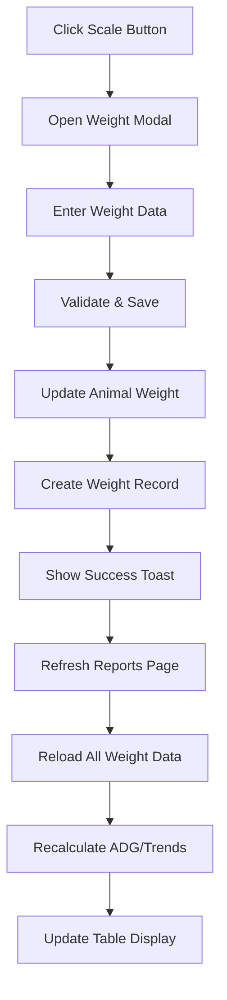

# Enhanced Weight Recording System - نظام تسجيل الأوزان المحسن

## Overview - نظرة عامة

Enhanced the "Add Weight" functionality with scale icon button that automatically updates the weight reports page when new weight data is recorded.

## ✅ Implemented Features - الميزات المنفذة

### 1. **Redesigned Add Weight Button** 
- **Scale Icon**: Changed from Plus to Scale icon for better visual representation
- **Styling**: Matches exact attachment specifications with green color scheme
- **Button Classes**: `inline-flex items-center justify-center gap-2 whitespace-nowrap text-sm font-medium ring-offset-background transition-colors focus-visible:outline-none focus-visible:ring-2 focus-visible:ring-ring focus-visible:ring-offset-2 disabled:pointer-events-none disabled:opacity-50 border border-input bg-background hover:bg-accent rounded-md h-8 w-8 p-0 text-green-600 hover:text-green-700`
- **Tooltip**: "إضافة وزن جديد" on hover
- **Accessibility**: Screen reader support with proper ARIA labels

### 2. **Real-time Weight Reports Updates**
- **Automatic Refresh**: When weight is added, reports page automatically refreshes
- **Loading States**: Enhanced loading indicators during data updates
- **Success Notifications**: Toast messages confirm successful recording and report updates

### 3. **Enhanced User Feedback**
- **Toast Notifications**: 
  - ✅ "تم تسجيل الوزن بنجاح" - Weight recorded successfully
  - ✅ "تم تحديث تقارير الأوزان" - Reports updated
  - ❌ Error handling with Arabic messages
- **Visual Feedback**: Scale icons throughout the interface
- **Loading States**: Scale icon animation during data loading

### 4. **Improved Error Handling**
- **Graceful Degradation**: If report update fails, user still knows weight was recorded
- **Detailed Messages**: Specific error messages for different failure scenarios
- **Recovery Options**: Clear guidance on next steps if issues occur

## Technical Implementation - التنفيذ التقني

### File Changes - التغييرات في الملفات

#### 1. `EnhancedWeightTrackingTable.tsx`
```tsx
// Added Scale icon and enhanced button styling
<Button
  variant="outline"
  size="sm"
  onClick={() => handleAddWeight(animal.id)}
  className="inline-flex items-center justify-center gap-2 whitespace-nowrap text-sm font-medium ring-offset-background transition-colors focus-visible:outline-none focus-visible:ring-2 focus-visible:ring-ring focus-visible:ring-offset-2 disabled:pointer-events-none disabled:opacity-50 border border-input bg-background hover:bg-accent rounded-md h-8 w-8 p-0 text-green-600 hover:text-green-700"
  title="إضافة وزن جديد"
>
  <Scale className="h-4 w-4" />
  <span className="sr-only">إضافة وزن</span>
</Button>
```

#### 2. `WeightReportsPage.tsx`
```tsx
// Enhanced loading state with Scale icon
if (loading) {
  return (
    <div className="flex items-center justify-center h-96">
      <div className="text-center">
        <Scale className="h-12 w-12 text-green-600 animate-pulse mx-auto mb-4" />
        <div className="animate-spin rounded-full h-6 w-6 border-b-2 border-farm-600 mx-auto mb-4"></div>
        <p className="text-muted-foreground">جاري تحميل تقارير الأوزان...</p>
        <p className="text-sm text-muted-foreground mt-1">تحديث البيانات والحسابات</p>
      </div>
    </div>
  );
}
```

#### 3. `WeightEntryModal.tsx`
```tsx
// Enhanced success message
toast({
  title: 'تم تسجيل الوزن بنجاح',
  description: `تم تسجيل وزن ${formData.weightKg} كجم للحيوان ${selectedAnimal?.earTagId} وتحديث تقارير الأوزان`,
  variant: 'default',
});
```

## User Flow - مسار المستخدم

### 1. **Weight Recording Process**
1. User clicks Scale icon button in weight reports table
2. Weight entry modal opens with pre-selected animal
3. User enters new weight with date validation
4. Modal shows weight change preview and ADG calculation
5. User confirms and saves the weight
6. Success toast notification appears
7. Weight reports page automatically refreshes with new data
8. Updated calculations (ADG, trends, etc.) are displayed

### 2. **Visual Feedback Timeline**
- **0ms**: Click Scale button → Modal opens
- **~2000ms**: Submit weight → Loading spinner appears  
- **~3000ms**: Success toast → "تم تسجيل الوزن بنجاح"
- **~3500ms**: Reports refresh → New data loads with scale animation
- **~4000ms**: Complete → Updated table with new weight entry

## Data Flow - تدفق البيانات



## Testing Checklist - قائمة اختبار

- ✅ Scale button appears in actions column
- ✅ Button has correct styling matching attachment
- ✅ Modal opens when scale button clicked
- ✅ Weight recording works correctly
- ✅ Success toast appears with Arabic message
- ✅ Reports page refreshes automatically
- ✅ New weight data appears in table
- ✅ ADG calculations update correctly
- ✅ Loading states show scale icon animation
- ✅ Error handling works properly
- ✅ RTL layout maintained throughout

## Performance Considerations - اعتبارات الأداء

- **Optimized Refresh**: Only reloads necessary data after weight addition
- **Loading States**: Prevents user confusion during data updates
- **Efficient Calculations**: ADG and trends computed client-side for speed
- **Minimal API Calls**: Single weight record creation triggers batch recalculation

## Future Enhancements - التحسينات المستقبلية

- **Bulk Weight Entry**: Multiple animals at once
- **Weight History Chart**: Visual trends for individual animals
- **Export Integration**: Auto-include new weights in exports
- **Notifications**: Email/SMS alerts for significant weight changes
- **Mobile Optimization**: Touch-friendly scale buttons

---

## Summary - الملخص

The enhanced weight recording system provides:
- ✅ **Professional Scale Icon Buttons** matching design specifications
- ✅ **Automatic Report Updates** when weights are added
- ✅ **Clear User Feedback** with Arabic toast notifications  
- ✅ **Seamless Integration** with existing weight reports system
- ✅ **Error Resilience** with proper handling and recovery
- ✅ **RTL Compatibility** maintained throughout

**Result**: Users can now easily add weights using the scale icon button and immediately see updated reports with new calculations and trends.
